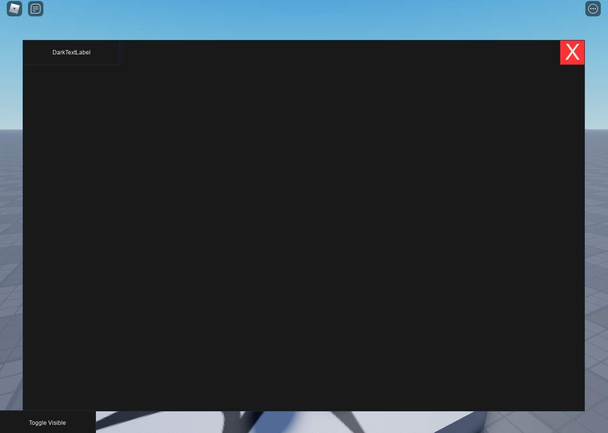

# Roact with Style
### A module that provides a simple way to apply style rules for Roact elements
**Full disclosure: I'm still a complete novice when it comes to working with Roact**
## Inspiration
I started working with Roact when I realized that how I was doing GUI in my own game wasn't sustainable. Sure, it was simple to *design* with, but each new addition proved to be more annoying than the last as I struggled with keeping track of references to specific instances in the tree when programming actual functionality.

Learning Roact seemed to be a good solution, as it enforced complete knowledge of the state of the interface and would have continued support in the future as the official framework by which Roblox itself uses for GUI.

However, I quickly realized that one of the limitations with Roact is that there was no simple way to quickly make a visually appealing interface; *every single* property of the GuiObjects had to be explicitly defined with each element, and trying to add pre-existing GuiObjects seemed like a hassle. Components are truly very useful for this task, but can only go so far.

So I came up with my own solution, the Style module. The module is meant to introduce a very simple way to apply a set of properties to all elements of a given Roact tree from outside of the explicit definition of elements, separating the tasks of creating a functioning core interface and turning it into a visually appealing product.

## Disclaimer
As of right now, the module is not used in any of my own public projects, as it's very much still a work in progress; what I have right now is something that can apply properties to a static Roact interface. There are a lot of limitations right now, such as:
- Properties are **directly overridden** when rendered (element.props), meaning
    - New styles cannot be applied to an element that already has styles applied to it; a *rough* solution is recreating the entire element(s) with the new style applied instead
    - Not well-suited to visual aspects that depend on state (i.e. an on/off button being green/red)
- Only one tag can be applied at a time


## Documentation
`Style.new(styleName string, rules {[string]: any}) -> new Style object`

Rules should be a dictionary that consists of string keys
that correspond to either Instance classes (i.e. "Frame"),
your own stateful components (Roact.Components:extend("Name")),
or your own tags that will be defined in your own Roact element/components.
Note that you cannot use the tag `Global`. `Global` is used to
indicate properties that will ATTEMPT to be applied to any element
regardless of class. It may be ommitted in definition.

If a given dictionary key is a valid Instance class,
the given properties rules MUST be valid properties of the given class.
Additionally, the definition must provide a valid value for the property.

Example (Good):
```lua
local RedFrame = Style.new("RedFrame", {
    Frame = {
        BackgroundColor3 = Color3.new(1, 0, 0) --> Valid property and value
    },
    Special = {
        SpecialText = "I'm Special" --> Rule is defined for a tag/custom component, and thus any property/value can be given
    }
}
```
Example (Bad):
```lua
local Red = Style.new("Red", {
    ScrollingFrame = {
        Color = Color3.new(1, 0, 0), --> Invalid property name for given Instance class
        Size = Vector2.new(100, 500) --> Invalid value given for the defined property
    },
    Frame = {
        IgnoreGuiInset = true, --> Property is not found in the given Instance class
        [Roact.Children] = {Roact.createElement("UIListLayout")} --> Only strings can be used as property keys
    }
}
```
With the Style module, I introduce the `Tag` property for elements.
Note that the `Tag` property will be removed (`element.props.Tag = nil`)
when a style is applied to a tree. I'm not 100% at the moment how to
better implement this, but for now the issue can be remedied by
explicitly creating a new element/tree whenever a style is to be applied.

Usage Example of `Tag`:
```lua
local TagExample = {
    Title = {
        Font = Enum.Font.ArialBold
    }
}

local TaggedElement = Roact.createElement("TextLabel", {
    Tag = "Title" --> When rendered, the TextLabel will have its Font property set to ArialBold
})
```

`Style:apply(element RoactElement) -> element`

Applies defined rules based on:

- Global
- tostring(element.props.component)
- element.props.Tag

in the above order.
Returns element for flexibility for different coding styles.
Will ignore any properties that were explicitly defined for the given element.
    
Example:
```lua
local Red = Style.new("Red", {
    Frame = {
        BackgroundColor3 = Color3.new(1, 0, 0)
    }
})

local element = Roact.createElement("Frame", {
    BackgroundColor3 = Color3.new(0, 0, 1)
})

Red:apply(element) --> When rendered, the Frame will be blue instead of red regardless of styles applied
```
Global rules will attempt to be applied, but will not error if the given definition is invalid.

Example:
```lua
local Light = Style.new("Light", {
    Global = {
        BackgroundColor3 = Color3.new(0.9, 0.9, 0.9),
        TextColor3 = Color3.new(0.1, 0.1, 0.1)
    },
    Title = {
        BackgroundColor3 = Color3.new(0.75, 0.75, 0.75),
        TextScaled = True,
        Text = "Title Placeholder"
    }
}

local tree = Roact.createElement("ScreenGui", {}, {
    Roact.createElement("TextLabel", {
        Tag = Title,
        Size = UDim2.new(1, 0, 0, 50)
    }),
    Roact.createElement("TextLabel", {
        Size = UDim2.new(1, 0, 1, -50),
        Position = UDim2.fromOffset(0, 50),
        Text = "Hello Style!"
    })
})

Roact.mount(tree, PlayerGui, "Global Example")
```
Any elements created, regardless of class, will have the Global properties given
if not explicitly defined or overridden by the class or tag rules.

### Full Example
```lua
local Player = game:GetService("Players").LocalPlayer

local Roact = require(Roact)
local Style = require(Style)

-- Create a new style that defaults to a darker look for the elements
local DarkMode = Style.new("DarkMode", {
    -- Set Global color values for a dark scheme
    Global = {
        BackgroundColor3 = Color3.new(0.1, 0.1, 0.1),
        TextColor3 = Color3.new(0.9, 0.9, 0.9)
    },
    -- Set placeholder text for TextLabels
    TextLabel = {
        Text = "DarkTextLabel",
        Size = UDim2.fromOffset(200, 50)
    },
    -- Set properties of a close button using tag CloseButton
    CloseButton = {
        BackgroundColor3 = Color3.new(1, 0.2, 0.2),
        Size = UDim2.fromOffset(50, 50),
        TextScaled = true,
        Text = "X"
    }
})

-- A basic menu using Roact
local Menu = Roact.Component:extend("Menu")
function Menu:init()
    self.visible, self.updateVisible = Roact.createBinding(true)
end
function Menu:render()
    return Roact.createElement("ScreenGui", {}, {
        Roact.createElement("Frame", {
            Size = UDim2.new(1, -100, 1, -100),
            AnchorPoint = Vector2.new(0.5, 0.5),
            Position = UDim2.fromScale(0.5, 0.5),
            Visible = self.visible
        }, {
            Roact.createElement("TextLabel"),
            Roact.createElement("TextButton", {
                AnchorPoint = Vector2.new(1, 0),
                Position = UDim2.fromScale(1, 0),
                Tag = "CloseButton",
                [Roact.Event.Activated] = function()
                    self.updateVisible(false)
                end
            })
        }),
        Roact.createElement("TextButton", {
            AnchorPoint = Vector2.new(0, 1),
            Position = UDim2.fromScale(0, 1),
            Size = UDim2.fromOffset(200, 50),
            Text = "Toggle Visible",
            [Roact.Event.Activated] = function()
                self.updateVisible(not self.visible:getValue())
            end
        })
    })
end

local DarkMenu = DarkMode:apply(Roact.createElement(Menu))

Roact.mount(DarkMenu, Player.PlayerGui, "Dark Menu")
```


Since I plan on using this for future projects, any feedback would be greatly appreciated! I still don't have that much knowledge about Roact, and would love to improve this module even further.